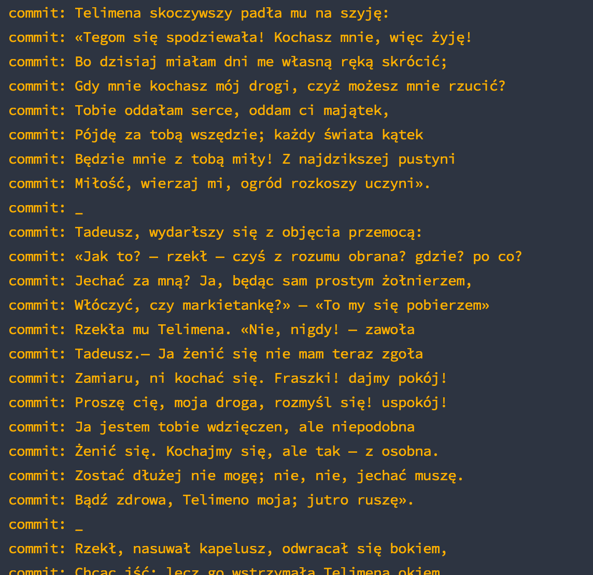

# Pan Tadeusz

## Adam Mickiewicz

- Cała lektura,
- Cały Pan Tadeusz, linijka po linijce,
- Czytaj online Pana Tadeusza,
- Znajdziesz za darmo Pana Tadeusza w `git reflog` w konsoli,
- albo online pod adresem [Pan Tadeusz w Commitach](http://github.com/unamatasanatarai/pan-tadeusz-adam-mickiewicz/commits/main)
- ...no i oczywiście tu w tym repo [pan-tadeusz-adam-mickiewicz.md](pan-tadeusz-adam-mickiewicz.md)

10822 commitów!

n'joy the read!
